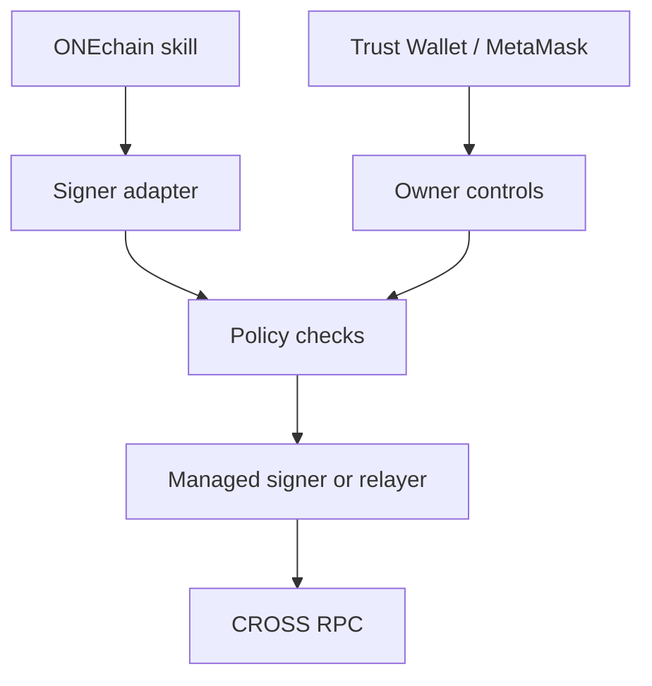

# ONEchain Wallet and Skill Wiring

This note defines how the ONEchain/CROSS skills should connect to a wallet without placing a phone-wallet private key in this repository, an AI session, or a skill `.env` file.

## Current status

Nine of ten ONEchain skills are installable. Six transaction-capable skills currently expect `PRIVATE_KEY` directly, so they are **not yet compatible with a managed signer without an adapter**.

| Skill | Mode today | Target wiring |
|---|---|---|
| `cross-explorer` | Read-only | RPC only |
| `cross-shop` | Limited read-only | API/RPC only until write support exists |
| `cross-wave` | Distributed version is read-only | API/RPC only |
| `cross-dex-trade` | Local EOA key | Signer adapter |
| `cross-prediction` | Local EOA key or gateway/PIN path | Signer adapter or supported gateway |
| `cross-crossd` | Reads without key; bridge writes need key | Signer adapter |
| `cross-rewards` | Local EOA key | Signer adapter |
| `cross-nft` | Reads without key; marketplace writes need key | Signer adapter |
| `cross-forge` | Local EOA key | Signer adapter |

## Recommended ownership model

Use two separate authorities:

1. **Trust Wallet or MetaMask Mobile** is the human owner. Its recovery phrase and private key remain only in the wallet and its offline backup.
2. **Managed automation signer** is a separate, revocable key held by a signer provider or secure key service.
3. **Smart account or policy layer** owns operational funds and accepts both authorities:
   - the phone owner can pause, revoke, recover, and withdraw;
   - the automation signer receives only narrow permissions, such as allowed contracts, token limits, per-transaction limits, and expiry times.

A normal EOA cannot give a second signer limited authority. Do not try to make Trust Wallet and an agent control the same EOA without sharing its raw key. Use a smart-contract account, delegated-permission system, or relayer policy layer.

## Transaction flow



The adapter should expose a small interface rather than a secret:

```ts
interface TransactionSigner {
  getAddress(): Promise<`0x${string}`>;
  signMessage(message: Uint8Array): Promise<`0x${string}`>;
  sendTransaction(request: {
    chainId: number;
    to: `0x${string}`;
    data?: `0x${string}`;
    value?: bigint;
  }): Promise<`0x${string}`>;
}
```

Each skill should use `SIGNER_MODE=managed` and a provider-specific credential reference or workload identity. It should not accept the managed signer's private key as `PRIVATE_KEY`.

Example configuration shape (names are placeholders until a provider is selected):

```dotenv
SIGNER_MODE=managed
SIGNER_PROVIDER=<provider>
SIGNER_KEY_ID=<non-secret-key-reference>
SIGNER_POLICY_ID=<policy-reference>
CROSS_RPC_URL=<rpc-url>
CROSS_CHAIN_ID=<verified-chain-id>
```

Do not commit real values from secret fields. Prefer workload identity or short-lived credentials over long-lived API tokens.

## Phone workflow

Trust Wallet is suitable as the human owner if the selected smart-account or dapp supports connecting through WalletConnect. MetaMask Mobile is the fallback. The phone wallet should approve account creation and emergency owner actions; routine agent transactions should go through the restricted managed signer.

The existing burner address `0x034E8911aa8433A41e471B3b672196544cCAd35F` is not the target production wallet. Its key was generated in an ephemeral session and may already be unrecoverable. Do not fund it unless its key is first recovered and imported locally. Even then, keep it as a low-value disposable test wallet.

## Implementation checklist

- [ ] Confirm the CROSS network chain ID, RPC URL, explorer, native token, and WalletConnect compatibility from official sources.
- [ ] Choose a managed signer and smart-account/policy provider that supports the CROSS network.
- [ ] Create the smart account with Trust Wallet as owner.
- [ ] Create a separate managed automation signer.
- [ ] Apply contract allowlists, spending caps, expiry, and an emergency pause/revoke path.
- [ ] Implement the `TransactionSigner` adapter in one transaction skill first.
- [ ] Test read, simulation, signing, broadcast, failure handling, and owner revocation with negligible funds.
- [ ] Migrate the other five transaction skills after the pilot passes.
- [ ] Remove or disable all production `PRIVATE_KEY` paths.
- [ ] Keep the agent account operational balance intentionally small.

## Secret-handling rules

- Never commit a private key, seed phrase, wallet export, QR code, or populated `.env`.
- Never paste wallet secrets into ChatGPT, Claude, Gemini, GitHub issues, PRs, logs, or CI output.
- Never use a personal treasury wallet as an automation signer.
- Rotate managed credentials and revoke the automation signer if a machine, CI job, or provider account may be compromised.
